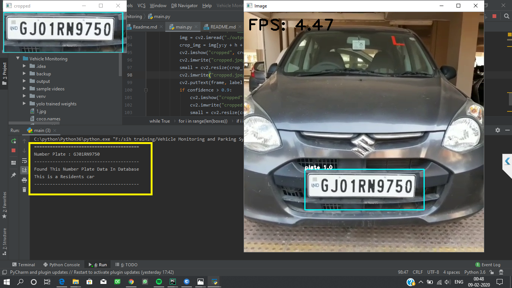

Important:  If while downloading this repo, you encounter 'Failed - Network error' problem,then try downloading again since it's a big one.
# Vehicle Monitoring and Parking System

This is our implementation of parking and detecting based on [YOLO](https://pjreddie.com/darknet/yolo/) 
approach done in Python 3.
We have trained our model using YOLOv3, based on the [Darknet framework](https://github.com/AlexeyAB/darknet) for object detection (licence plate in this case) with the help of Google Colab.

Note: If you want to view/download the training data, it can be done from the following Google Drive link: <br>[Link for dataset](https://drive.google.com/drive/folders/13WF2mS5kTC9xt0XG9xsEcd0X08OT_ngl?usp=sharing)
#### Team Name- Sigma Six
#### Team Leader- Patel Rushi Saileshbhai

#### The repository includes:
* Yolo based approach to Detect Vehicle Number Plates.
* OCR and text extraction of detected Number Plate.
* Parking and Monitoring premised on recognized feature.
* Restricted zone parking alert.


#### Results from training:


The columns in the given image represents Iterations, Loss of current iteration, average loss,
learning rate, seconds to load, loaded images(in batch of 64) respectively.
The mAP(mean Average Precision) achieved after 4100 iterations was **91.86%** trained on over 420 images.


## Requirements
* Python 3.x <br />
* OpenCV 3.2.0 and other common packages listed in `requirements.txt` in child directories.


## Getting Started
* Firstly we have prepared a Dataset which contains 420 images of cars which are taken at
different angles.
* We have labelled our whole dataset for YOLO custom object detection.
* The input images are present in the Input images for training folder and the generated
labels are present in YOLO labels.
* [Training_Number_Plate.ipynb](Training_number_Plate.ipynb)  file is the training which is used to train YOLO for custom object detection like
number plates.
* The Training file along with the dataset file is zipped into the folder and uploaded on 
the drive for training.
* We are using Google Colaboratory for training our model.
* Now that our model is trained we have to load our model for custom object detection.
* We have divided our project in two parts<br/>
    1.Vehicle Monitoring<br/>
    2.Vehicle Parking


### 1.Vehicle Monitoring
* Vehicle Monitoring means monitoring of vehicles and keeping a record of every vehicle 
that passes by.
* In our Monitoring system it will monitor whether a particular vehicle is a Residents
Vehicle or Visitors Vehicle.
* Run the `main.py` file in **Vehicle Monitoring** directory.
```python
# from main.py
net = cv2.dnn.readNetFromDarknet("./yolo trained weights/yolov3-obj.cfg",
                                 "./yolo trained weights/yolov3-tiny-obj_4000.weights")
net.setPreferableTarget(DNN_BACKEND_OPENCV)
```
* `readNetFromDarknet()` is used to load the trained model weights and configure file.
* `setPreferableTarget() ` will instantiate this model on CPU.
* After the bounding box is generated we apply OCR(Optical Character Recognization) for the
the rocognition of the characters.
* By applying OCR on number plate the value of Number plate is extracted and that value 
will be used to identify whether it is a Resident or a Vistor.
* For this we have created a fictional database of residents residing in a particular society.
* Now what happens is after the Number Plate is extracted, comparisons with database is made and processing is done accordingly.
* If the same Number Plate is found in the Database then it is a Resident otherwise it
is a Visitor.
* After identifying as Visitor its record is maintained in our Visitor database with 
entry time.
* You can view our database entries by running `resident.py` in **Database folder**  
 
#### Results of Vehicle Monitoring(Identified as Resident):



#### Results of Vehicle Monitoring(Identified as Visitor):


## 2.Vehicle Parking
* We have divided the parking scenario into two parts<br/>
 i.  Commercial Parking<br/>
 ii. Residential Parking <br/>
 
#### i.Commercial Parking
* In this scenario whenever you visit any public or commercial place you have to traverse whole
parking in search of a parking spot.
* What our system does is that it shows which slot is available for parking and tells the 
person to park at that place and if the parking is full it will tell from the entry that 
parking is full so you dont have to traverse whole parking.
* When we run `main.py` file in **Commercial Parking** directory the YOLO model trained for custom object 
detection is loaded and it creates the bounding box around the number plate.
* After the bounding box is created the plate value is fetched by by applying OCR(Optical
Character Recognition).
* After fetching the Number Plate it checks in Commercial Parking Database which slot is 
empty and it displays it.
* After Fetching the Number Plate if the parking is full and no slot is available it 
will show slot not available.
* You can view our database entries by running `commercialparking.py` in **Database folder**

#### Results of Commercial Parking(Slots are available):


#### Results of Commercial Parking(Slots are not available):


#### ii.Residential Parking
* Nowdays in Resident socities you are permanently alloted some parking slot and you
park your vehicle at that place only and you pay for that place.
* What our system does in case of Residential Parking is that it classifies whether it is 
a resident or visitor.
* Run the `main.py` file in **Residential Parking**.
* Further steps are similar to the ones in aforementioned process of `Commercial Parking`.
* If he is a Resident then it displays all the details of the Resident along with the alloted
slot value.
* If he is a Visitor a record is kept in Visitor database along with the fetched Number Plate 
and the Entry time of the vehicle.
* Currently only statically passed values seem to work. If some other person in the society has parked at your placed then by running `Wrongslot.py` 
you will come to know has parked at your alloted slot along with the contact number.
```python
#wrongslot.py
slot_allot('GJ18BG5803',5)
```
* The contact Number of the wrong person will be displayed in the android app.
* You can view our database entries by running `resident.py` in **Database folder**
* If classified as visitor you can view our database entries by running `visitor.py` in **Database folder**


#### Results of Residential Parking(Identified as Resident):


#### Results of Residential Parking(Identified as Visitor):


#### Results of Residential Parking(Someone has parked at your Slot):


#### 3.No Parking Solution

* It happens frequently that people deliberately park at restricted parking zones. So it is
a necessity to prevent this from occuring chronically. 
We have put forward a solution that tries to address this scenario.
* Run the `main.py` in the **No Parking Solution** directory to get started. 
* A window will pop up with an image of the parking lot, create bounding boxes. These boxes will indicate the restricted
parking zones.

* You can change the video/image by editing the arguments passed in the main file as given below
```python
# --image images/parkinglotimage.png  --data data/coordinates_1.yml --video videos/your_video_file.mp4 --start-frame 1
```
* (PROPOSED) As soon as these restricted parks are acquired, an alert can be sent to nearby towing authority/RTO officer or
 penalty can be charged on that vehicle by RTO officals. 
 Note: For this to work, number plate extraction is to be done.
 


